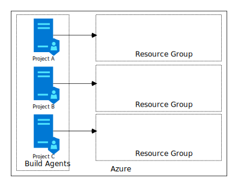

# DevOps
## About
As companies accelerate their move to the cloud, they run into scenarios where empowering employees, securing the environment and running costs start to negatively impact one another. 

In this article, we'll consider a real-life customer scenario - although generalized to protect the innocent. 

Consider the following scenario: A company has dozens of applications under active development / support. Each application has a dedicated team working on it and these teams are responsible for their own app and infra. The source code for these applications and the supporting infrastructure is stored on premises and is not accessible via the internet. The company is in favor of using Pipelines in Azure DevOps to manage their release process for Azure deployments, requiring to provision the infrastructure and deploy the application. 

>**Introduction to Azure DevOps**: [Azure DevOps](https://docs.microsoft.com/en-us/azure/devops/user-guide/what-is-azure-devops?view=azure-devops) is a Microsoft service, offering end-to-end capabilities required for software development teams. Azure DevOps focusses on application development teams and is used by enterprises and individual users. 
>Azure DevOps consists of a set of services, ranging from [Repos](https://azure.microsoft.com/services/devops/repos/) that store and version your source code, via [Pipelines](https://azure.microsoft.com/services/devops/pipelines/) that allow for hosting your CI/CD process, planning project activities and track progression via [Boards](https://azure.microsoft.com/services/devops/boards/) and [Test Plans](https://azure.microsoft.com/en-us/services/devops/test-plans/) and distribute versions of your project and its components as [Artifacts](https://azure.microsoft.com/en-us/services/devops/artifacts/). 

To achieve their goals, the customer realized that they'll need to address several challenges: 
- Allow the Azure Pipeline to connect to the on premises repository (Networking, Identity)
- Allow the Azure Pipeline to create and configure Azure resources that are required by the application that is being deployed (RBAC)
- Prevent Azure Pipeline to create, delete or modify Azure resources that are **not** related to the application that is being deployed (RBAC)

Once they realize that Microsoft-hosted agents will not be able to access the source code, they start looking at assigning limited permissions to individual teams / applications and leverage self-hosted agents to address infrastructure limitations. 

Applying this concept to their organization, they drafted an initial approach and got started. For every team and/or application: 
1) In the Azure DevOps organization, create a Project
2) In the Azure environment, create an Azure Subscription or Resource Group1
3) In the Azure environment, create a self-hosted build agent (VM) that connects to our Azure DevOps project. Configure the VM with a Managed Service Identity
4) Grant the MSI permissions to this subscription or resource group
5) In Azure DevOps, configure the build / release pipelines to use the registered self-hosted build agent

This works! The approach addresses all of the challenges identified at the beginning of this article and is mostly manageable. 

Unfortunately, the approach has some limitations as well. As time progresses and the number of project using this setup will grow, so do the costs involved in running a large number of self-hosted build agents. What works for few applications does not work for many. 

So... how could we optimize?

### Reduce running costs of the current setup
#### Option 1: Keep setup as-is; configure Auto-shutdown / automated startup
A quick mitigation is to shut down the environment outside of business hours. This is relatively simple to complete and comes with immediate cost savings as  reducing the compute hours from 24*7 to 12*5 is reducing overall costs with 60%!

#### Option 2: Keep setup as-is; switch to B-series machines
Shutting down our build agents might not be desirable, as development activities could happen across timezones and nightly builds / test runs are a thing for this customer. 

An alternative is to change from regular VMs to the burstable [B-series VMs](https://azure.microsoft.com/nl-nl/blog/introducing-b-series-our-new-burstable-vm-size). B-series are charged at a lower rate (around 15%) and offer a great alternative for regular VMs in scenarios where the VM has frequent, but unpreditable, periods of idle time. 

When idle, the B-series will generate credits which can be used to perform at full capacity at later time. When the credits run out, the system will be throttled to run at a lower capacity.

#### Option 3: Keep setup as-is; Leverage Reserved Instances
Another way to reduce costs is via [Reserved Instances (RI)](https://azure.microsoft.com/en-us/pricing/reserved-vm-instances/). With RI, you commit upfront to a particular workload for the next 1 or 3 years. In return, Microsoft bills your workload at a discounted rate, depending on the type of resource and the region (see [Azure Pricing Calculator](https://azure.microsoft.com/en-us/pricing/calculator/). 

> To optimize costs, B-Series VMs can be _combined_ with Reserved Instances. 
>
> To illustrate this, let's use the Azure Calculator to compare the price in North Europe for
> * a single DS3v2 (4 vCPU, 14GB RAM, 28GB Temp storage), without reservations 
> * a B4MS (4 vCPU, 14GB RAM, 32GB Temp storage) + 3 years reservation
>
> The savings are more than **73%**! This goes beyond what can be achieved with shutting down the machines.

### Reconsider our setup
The main driver for our build agents is the linear growth in the number of VMs required. If we can reduce the number of VMs involved, the costs go down. 

### Option 4: Container Orchestrator
Containers are a great solution for many problems; why not use them here?

>**_PLACEHOLDER: MORE DETAILED ARGUMENTATION GOES HERE_**
>- Managed identities via [Azure AAD Pod Identity](https://github.com/Azure/aad-pod-identity)
>- small 'bootstrapper' on AKS + virtual kubelet / ACI for actual build?
>- Build agents may not be ideal candidates for horizontal scale-out, as they are resource-hungry?

### Option 5: Using a shared pool of build agents
One of the main limitations of the MSI-based model is the linear scaling of VMs or containers based on the number of _projects_. If we could share our build agents across projects instead, the scaling will be linear to the number of _concurrent pipelines we need to support_. 

That makes for a much easier conversation, so let's think about how we can sharing the resources across projects - without sacrificing security or isolation. 

## The concepts
### Azure DevOps Agent Pools
In Azure DevOps, self-hosted build agents are managed via so-called [Agent Pools](https://docs.microsoft.com/en-us/azure/devops/pipelines/agents/pools-queues?view=azure-devops&tabs=yaml). Every running build agent is expected to register itself with the pool, and every pipeline will define from which pool it expects to be granted resources when executing its jobs. 

Agent Pools can be defined / made available at the level of the organization or on the level of individual projects within an Azure DevOps organization.

### Service Connections
In Azure DevOps, Service Connections allow us to register a connection with an  external / remote services _once_ and reference to that connection within the scope of the project or organization. Sensitive information (such as the credentials) is only accessible to the platform, not to the end-user. 

During execution of a Pipeline, DevOps will pass the service connection to the build agent running the job. This allows the build agent to interact with the external / remote service in a secure way.

### Azure Kubernetes Cluster Scaling
A container orchestrator allows us to manage a given workload on a cluster of VMs. To optimize running costs while maximizing the number of concurrent pipeline executions, it would be very beneficial to dynamically scale the number of nodes in the cluster. 

Fortunately, this is possible in multiple ways: 
- [AKS Auto-scaler](https://docs.microsoft.com/en-us/azure/aks/cluster-autoscaler) (Preview) - Scales out the underlying cluster, to be used by Kubernetes to host 1 or more containers.
- [Virtual Kubelet](https://docs.microsoft.com/en-us/azure/aks/virtual-kubelet) - runs a single container on an Azure Container Instance. 

## Solution diagram

## Creating the solution
[Docker client]()
[Create a docker-based agent](https://docs.microsoft.com/en-us/azure/devops/pipelines/agents/docker?view=azure-devops)
[Publish to a private repo](https://docs.microsoft.com/en-us/azure/container-registry/container-registry-get-started-docker-cli)

[Connect kubectl](https://social.technet.microsoft.com/wiki/contents/articles/51499.azure-kubernetes-service-aks-getting-started.aspx)

## Next steps

### Hardening the build agents

## Errata
1 Both Subscriptions and Resource Groups provide sufficient isolation for this article. Evaluating all considerations that apply to your particular case would be beyond the scope of this article. 